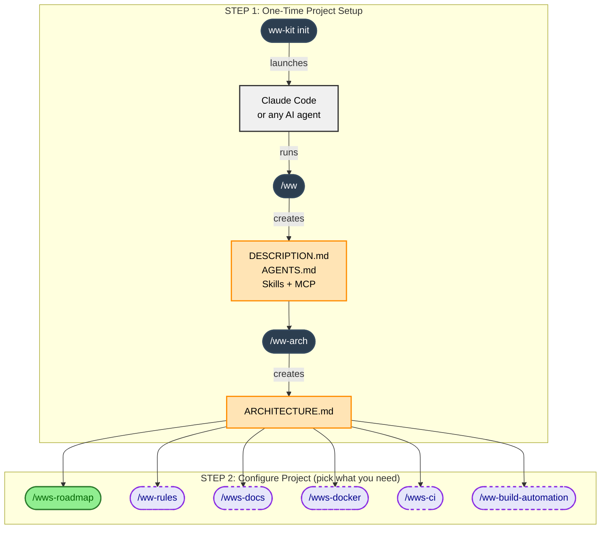
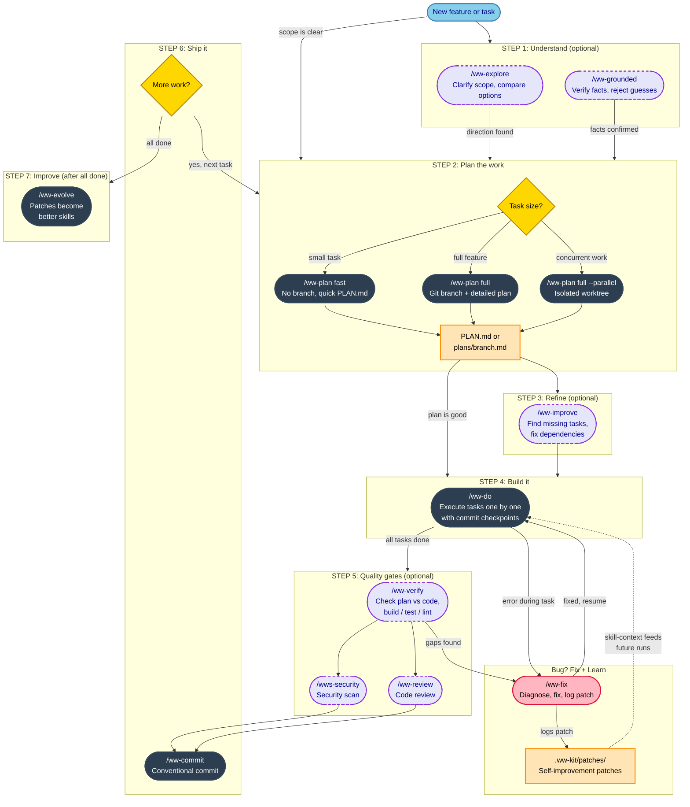

[← Getting Started](getting-started.md) · [Back to README](../README.md) · [Reflex Loop →](loop.md)

# Development Workflow

ww-kit has two phases: **configuration** (one-time project setup) and the **development workflow** (repeatable loop of explore → plan → improve → implement → verify → commit → evolve).

## Project Configuration

Run once per project. Sets up context files that all workflow skills depend on.



## Development Workflow

The repeatable development loop. Each skill feeds into the next, sharing context through plan files and patches.

Optional discovery step: use `/ww-explore` before planning to investigate ideas, compare options, and clarify requirements.

Reliability gate: use `/ww-grounded` when the main problem is not discovery but certainty - high-stakes answers, changeable facts, version-sensitive behavior, or any request where the model must refuse to guess.

If you want exploration results to survive `/clear` and feed directly into planning, ask `/ww-explore` to save them to `.ww-kit/RESEARCH.md`.



## When to Use What?

| Command | Use Case | Creates Branch? | Creates Plan? |
|---------|----------|-----------------|---------------|
| `/ww-explore` | Discovery, option comparison, and requirements clarification before planning | No | No (optional `.ww-kit/RESEARCH.md` on request) |
| `/ww-grounded` | Evidence-only answers, strict verification, and high-stakes questions where guessing is unacceptable | No | No |
| `/wws-roadmap` | Strategic planning, milestones, long-term vision | No | `.ww-kit/ROADMAP.md` |
| `/ww-plan fast` | Small tasks, quick fixes, experiments | No | `.ww-kit/PLAN.md` |
| `/ww-plan full` | Full features, stories, epics | Yes | `.ww-kit/plans/<branch>.md` |
| `/ww-plan full --parallel` | Concurrent features via worktrees | Yes + worktree | Autonomous end-to-end |
| `/ww-improve` | Refine plan before implementation | No | No (improves existing) |
| `/ww-loop` | Iterative generation with quality gates and phase-based cycles | No | No (uses `.ww-kit/evolution/`) |
| `/ww-reference` | Create knowledge refs from URLs/docs for AI agents | No | No (`.ww-kit/references/`) |
| `/ww-fix` | Bug fixes, errors, hotfixes | No | Optional (`.ww-kit/FIX_PLAN.md`) |
| `/ww-verify` | Post-implementation quality check | No | No (reads existing) |

## Artifact Ownership and Context Gates

Ownership is command-scoped to avoid conflicting writers:

| Command                                   | Primary artifact ownership                                                                               | Notes                                                   |
|-------------------------------------------|----------------------------------------------------------------------------------------------------------|---------------------------------------------------------|
| `/ww`                                    | `.ww-kit/DESCRIPTION.md`, setup `AGENTS.md`                                                          | invokes `/ww-arch` for architecture file       |
| `/ww-arch`                       | `.ww-kit/ARCHITECTURE.md`                                                                            | may update architecture pointer in DESCRIPTION/AGENTS   |
| `/wws-roadmap`                            | `.ww-kit/ROADMAP.md`                                                                                 | `/ww-do` may mark completed milestones          |
| `/ww-rules`                              | `.ww-kit/RULES.md`                                                                                   | append/update rules only                                |
| `/ww-plan`                               | `.ww-kit/PLAN.md`, `.ww-kit/plans/<branch>.md`                                                   | `/ww-improve` refines existing plans                   |
| `/ww-explore`                            | `.ww-kit/RESEARCH.md`                                                                                | all other artifacts are read-only in explore mode       |
| `/ww-reference`                          | `.ww-kit/references/*`, `.ww-kit/references/INDEX.md`                                            | knowledge references from external sources              |
| `/ww-fix`                                | `.ww-kit/FIX_PLAN.md`, `.ww-kit/patches/*.md`                                                    | bug-fix learning loop artifacts                         |
| `/ww-evolve`                             | `.ww-kit/evolutions/*.md`, `.ww-kit/evolutions/patch-cursor.json`, `.ww-kit/skill-context/*` | skill-context overrides + evolution logs + cursor state |
| `/ww-commit` `/ww-review` `/ww-verify` | read-only context by default                                                                             | gate and report, no default context-file writes         |

Context-gate defaults for `/ww-commit`, `/ww-review`, `/ww-verify`:
- Check architecture, roadmap, and rules alignment as read-only context.
- Missing optional files (`ROADMAP.md`, `RULES.md`) are `WARN`, not immediate failures.
- In strict verification, clear architecture/rules violations and clear roadmap mismatch are blocking failures.

## Workflow Skills

These skills form the development pipeline. Each one feeds into the next.

### `/ww-explore [topic or plan name]` — discovery before planning

```
/ww-explore real-time collaboration
/ww-explore the auth system is getting unwieldy
/ww-explore add-auth-system
```

Thinking-partner mode for exploring ideas, constraints, and trade-offs without implementing code. Reads `.ww-kit/DESCRIPTION.md`, `ARCHITECTURE.md`, `RULES.md`, `.ww-kit/RESEARCH.md`, and active plan files for context. If you want the context to persist across sessions (or after `/clear`), save it to `.ww-kit/RESEARCH.md`. When direction is clear, transition to `/ww-plan fast` or `/ww-plan full`.

### `/ww-grounded [question or task]` — certainty before action

```
/ww-grounded Does this repo already support feature flags?
/ww-grounded Which command should I use if I need a fully verified answer?
```

Reliability-gate mode for evidence-backed answers. Use it when the task is already clear but the answer must be strictly verified: high-stakes requests, version-sensitive facts, current-state questions, or any prompt that says "no assumptions". Unlike `/ww-explore`, it is not for brainstorming or open-ended trade-off mapping; it either answers from evidence with `Confidence: 100/100` or stops with `INSUFFICIENT INFORMATION` and tells you what is missing.

### `/wws-roadmap [check | vision]` — strategic planning

```
/wws-roadmap                              # Create or update roadmap
/wws-roadmap SaaS for project management  # Create from vision
/wws-roadmap check                        # Auto-scan: find completed milestones
```

High-level project planning. Creates `.ww-kit/ROADMAP.md` — a strategic checklist of major milestones (not granular tasks). Use `check` to automatically scan the codebase and mark milestones that appear done. `/ww-do` also checks the roadmap after completing all tasks.

### `/ww-plan [fast|full] <description>` — plan the work

```
/ww-plan Add user authentication with OAuth       # Asks which mode
/ww-plan fast Add product search API              # Quick plan, no branch
/ww-plan full Add user authentication with OAuth  # Git branch + full plan
/ww-plan full --parallel Add Stripe checkout      # Parallel worktree
```

Two modes — **fast** (no branch, saves to `.ww-kit/PLAN.md`) and **full** (creates git branch, asks about testing/logging/docs policy and optional roadmap milestone linkage when `.ww-kit/ROADMAP.md` exists, saves to `.ww-kit/plans/<branch>.md`). Analyzes requirements, explores codebase for patterns, creates tasks with dependencies. For 5+ tasks, includes commit checkpoints. For parallel work on multiple features, use `full --parallel` to create isolated worktrees.

### `/ww-improve [--list] [@plan-file] [prompt]` — refine the plan

```
/ww-improve
/ww-improve --list
/ww-improve @my-custom-plan.md
/ww-improve add validation and error handling
```

Second-pass analysis. Finds missing tasks (migrations, configs, middleware), fixes dependencies, removes redundant work. Plan source priority: `@plan-file` argument, then branch-based `.ww-kit/plans/<branch>.md`, then `.ww-kit/PLAN.md`, then `.ww-kit/FIX_PLAN.md`. `--list` is a read-only discovery mode that shows available plan files and exits. Shows a diff-like report before applying changes.

### `/ww-loop [new|resume|status|stop|list|history|clean] [task or alias]` — iterative quality loop

```
/ww-loop new OpenAPI 3.1 spec + DDD notes + JSON examples
/ww-loop resume
/ww-loop status
/ww-loop list
/ww-loop history courses-api-ddd
/ww-loop clean courses-api-ddd
```

Runs a strict Reflex Loop with 6 phases: PLAN -> PRODUCE||PREPARE -> EVALUATE -> CRITIQUE -> REFINE. PRODUCE and PREPARE run in parallel via `Task` tool; EVALUATE runs check groups in parallel. Before iteration 1, it always asks for explicit confirmation of success criteria and max iterations (even if both are already in task text). Keeps one active loop pointer in `.ww-kit/evolution/current.json` and per-task run state in `.ww-kit/evolution/<alias>/run.json` with append-only events in `history.jsonl` and latest output in `artifact.md`. Stops on threshold reached, no major issues, stagnation, or max iterations (default: 4). If loop stops on max iterations without passing criteria, final summary includes distance-to-success metrics (threshold gap + remaining blocking fail-rules). Use `list` to see all loop runs, `history` to view events, `clean` to remove old loop runs.

For full contracts and state transition rules, see [Reflex Loop](loop.md).

### `/ww-do` — execute the plan

```
/ww-do        # Continue from where you left off
/ww-do --list # Show available plans only (no execution)
/ww-do @my-custom-plan.md # Execute using an explicit plan file
/ww-do 5      # Start from task #5
/ww-do status # Check progress
```

Reads skill-context rules first, then uses limited recent patch fallback when needed. Executes tasks one by one with commit checkpoints. Plan source priority: `@plan-file` argument, then branch-based `.ww-kit/plans/<branch>.md`, then `.ww-kit/PLAN.md`, then `.ww-kit/FIX_PLAN.md` (redirects to `/ww-fix`). `--list` is a read-only discovery mode that shows available plan files and exits. Docs policy after completion: `Docs: yes` → mandatory docs checkpoint (update docs / create feature page / skip, routed via `/wws-docs`), `Docs: no` or unset → `WARN [docs]` only.

### `/ww-verify [--strict]` — check completeness

```
/ww-verify          # Verify implementation against plan
/ww-verify --strict # Strict mode — zero tolerance for gaps
```

Optional step after `/ww-do`. Goes through every task in the plan and verifies the code actually implements it. Checks build, tests, lint, looks for leftover TODOs, undocumented env vars, and plan-vs-code drift. If gaps are found, it first suggests `/ww-fix <issue summary>` (recommended). If verification is clean, it suggests `/wws-security` and `/ww-review`. Use `--strict` before merging to main.

Also runs read-only context gates against `.ww-kit/ARCHITECTURE.md`, `.ww-kit/ROADMAP.md` (if present), and `.ww-kit/RULES.md` (if present). In normal mode, roadmap/milestone linkage gaps are warnings; in strict mode, clear roadmap mismatch is a failure, while missing `feat`/`fix`/`perf` milestone linkage remains a warning.

### `/ww-review` — code review with read-only context gates

Reviews staged changes or PR diff and reports correctness/security/performance findings. Includes read-only architecture/roadmap/rules gate notes in review output (`WARN` for non-blocking inconsistencies, `ERROR` only for explicitly blocking criteria).

### `/ww-commit` — conventional commit with read-only context gates

Creates conventional commits from staged changes and runs read-only architecture/roadmap/rules checks before finalizing the message. By default this remains warning-first (no implicit strict mode). For `feat`/`fix`/`perf` commits, missing roadmap milestone linkage is reported as warning.

### `/ww-fix [bug description]` — fix and learn

```
/ww-fix TypeError: Cannot read property 'name' of undefined
```

Two modes — choose when you invoke:
- **Fix now** — investigates and fixes immediately with logging
- **Plan first** — creates `.ww-kit/FIX_PLAN.md` with analysis and fix steps, then stops for review

When a plan exists, run without arguments to execute:
```
/ww-fix    # reads FIX_PLAN.md → applies fix → deletes plan
```

Every fix creates a **self-improvement patch** in `.ww-kit/patches/`. Patches improve future workflow runs primarily through `/ww-evolve` (which distills them into `.ww-kit/skill-context/*`).

### `/ww-evolve` — improve skills from experience

```
/ww-evolve          # Evolve all skills
/ww-evolve fix      # Evolve only the fix skill
```

Reads patches incrementally using an evolve cursor, analyzes project patterns, and proposes targeted skill improvements. Closes the learning loop: **fix → patch → evolve → better skills → fewer bugs**.

---

For full details on all skills including utility commands (`/wws-docs`, `/wws-docker`, `/wws-build`, `/wws-ci`, `/ww-commit`, `/wws-skill`, `/ww-reference`, `/wws-security`), see [Core Skills](skills.md).

## Why Spec-Driven?

- **Predictable results** - AI follows a plan, not random exploration
- **Resumable sessions** - progress saved in plan files, continue anytime
- **Commit discipline** - structured commits at logical checkpoints
- **No scope creep** - AI does exactly what's in the plan, nothing more

## See Also

- [Reflex Loop](loop.md) — strict iterative loop contracts and state transitions
- [Core Skills](skills.md) — detailed reference for all workflow and utility skills
- [Plan Files](plan-files.md) — how plan artifacts are stored and managed
